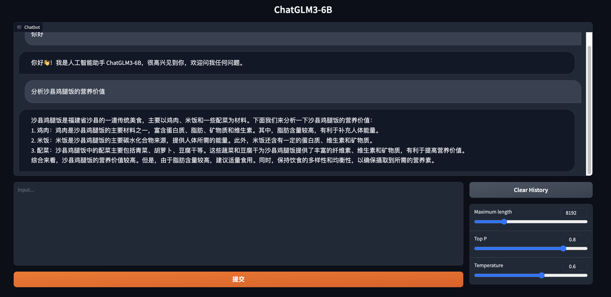
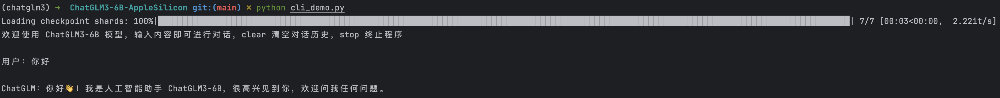

# ChatGLM3-6B-AppleSilicon

本项目旨在实现将ChatGLM3-6B模型部署在Mac M1/2/3系列处理器上进行推理，代码核心部分来自[ChatGLM3](https://swanhub.co/ZhipuAI/ChatGLM3)。

**配置要求：**

- MacOS，处理器为M系列

- 12GB以上内存。


🚀**迭代计划：**

- [ ] 增加基于fastapi的推理API脚本  
- [ ] 增加Docker部署


## 🔥使用流程

### 1.下载ChatGLM3-6B权重

方式一：git下载（需要安装git lfs）：

```bash
git lfs install
git clone https://swanhub.co/ZhipuAI/chatglm3-6b.git
```

方式二：浏览器下载：

访问[ChatGLM3-6b](https://swanhub.co/ZhipuAI/chatglm3-6b/tree/master)，将每个文件全部下载下来。

其他权重下载同理：[ChatGLM3-6b-32k](https://swanhub.co/ZhipuAI/chatglm3-6b-32k)｜[ChatGLM3-6b-base](https://swanhub.co/ZhipuAI/chatglm3-6b-base)


### 2.安装依赖环境

```bash
pip install -r requirements.txt
```


### 3.启动Demo

将下载好的文件移动到`checkpoint_chatglm3_6b`文件夹中，然后：

【Gradio】

```bash
python web_demo_gradio.py
```




【StreamLit】

```bash
streamlit run web_demo_streamlit.py
```


【命令行】

```bash
python cli_demo.py
```




## 📔相关链接

- ChatGLM3：https://swanhub.co/ZhipuAI/ChatGLM3

